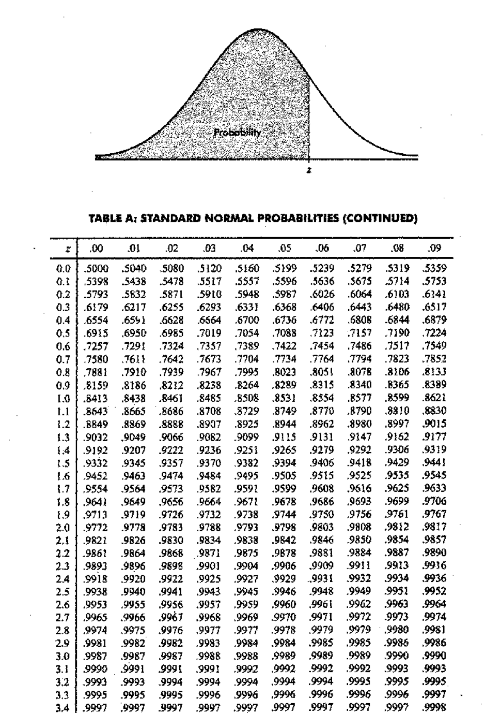
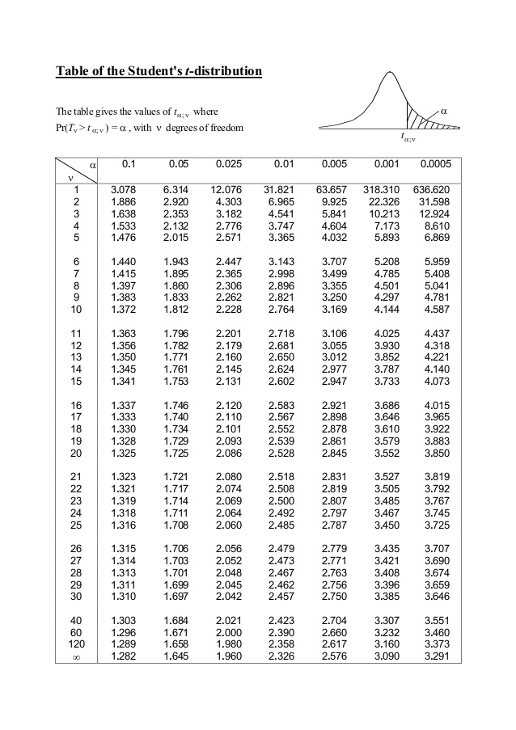
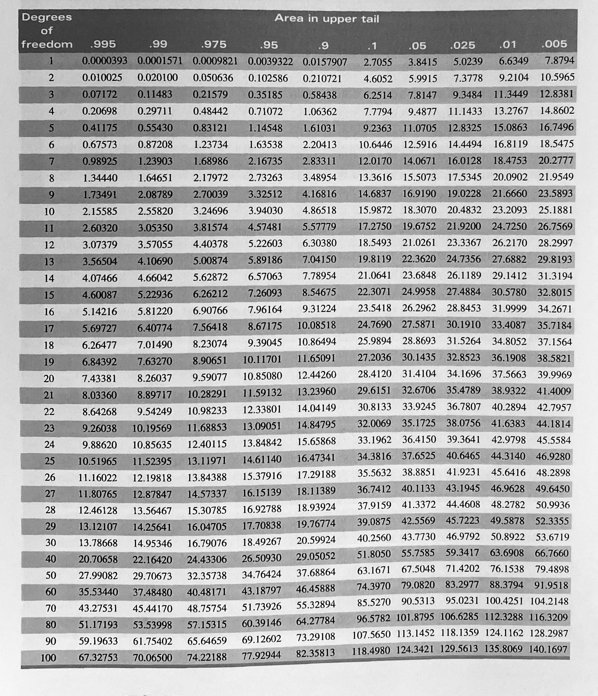

\pagenumbering{arabic}

# Interval Estimation

-   Under point estimation of a parameter $\theta$, the inference is a guess of a **single value** as the value of $\theta$.

-   Instead of making the inference of estimating the true value of the parameter to be a point, under interval estimation we make the inference of estimating that the true value of the parameter is contained in **some interval.**

## What is gained by using an Interval Estimator?

**Example** <!-- Cassela and berger page 418, mood pg 372-->

-   For a sample $X_1, X_2, X_3, X_4$ from a $N(\mu, 1),$ an interval estimator of $\mu$ is $[\bar{X}-1, \bar{X}+1].$

-   This means that we will assert that $\mu$ is in this interval.

-   In the previous section (Point estimation) we estimated $\mu$ with $\bar{X}.$

-   But now we have the less precise estimator $[\bar{X}-1, \bar{X}+1]$.

-   Under interval estimation, by giving up some precision in our estimate (or assertion about $\mu$), we try to gain some confidence , or assurance that our assertion is correct.

**Explanation**

-   When we estimate $\mu$ by $\bar{X},$ the probability that the estimator exactly equaled the value of the parameter being estimated is zero (Why? the probability that a continuous random variable equals any value is 0), *i.e.* $P(\bar{X}=\mu) = 0.$

-   However, with an interval estimator, we have a positive probability of being correct.

-   The probability that $\mu$ is covered by the interval $[\bar{X}-1, \bar{X}+1]$ can be calculated as $$P(\mu \in [\bar{X}-1, \bar{X}+1])= P(\bar{X}-1 \leq \mu\leq \bar{X}+1)$$ $$ = P(-1 \leq \bar{X} - \mu\leq 1)$$ $$ = P(- 2\leq \frac{\bar{X} - \mu}{\sqrt{1/4}}\leq 2)$$ $$ = P(- 2\leq Z\leq 2)\;\;\; \left(\frac{\bar{X} - \mu}{\sqrt{1/4}} \text{ is standard normal }\right)$$ $$=0.9544.$$

-   Therefore now we have over 95% chance of covering the unknown parameter with the interval estimator.

-   By moving for a point to an interval we have scarified some precision in our estimate. But it has resulted in increased confidence that our assertion is correct.

-   The purpose of using an interval estimator rather than a point estimator is to have some guarantee of capturing the parameter of interest.

<!--mood 377, bsc note-->

## Definition of confidence interval

**Definition**

Let $X_1, X_2, \dots, X_n$ be a random sample from a distribution with parameter $\theta.$ Let $T_1 = g(X_1, X_2, \dots, X_n),$ and $T_2 = h(X_1, X_2, \dots, X_n)$ be two statistics satisfying $T_1 \leq T_2$ for which $P(T_1 < \theta < T_2)= \gamma,$ where $\gamma$ does not depend on $\theta$. Then, the random interval $(T_1, T_2)$ is called a $100\gamma$ **percent confidence interval for** $\theta$; $\gamma$ is called the confidence coefficient; and $T_1$ $T_2$ are called the lower and upper confidence limits, respectively, for $\theta.$

Suppose that $x_1, x_2, \dots, x_n$ is a realization of $X_1, X_2, \dots, X_n$ and let $t_1 = g(x_1, x_2, \dots, x_n),$ and $t_2 = h(x_1, x_2, \dots, x_n)$. Then the *numerical* interval $(t_1, t_2)$ is also called a $100\gamma$ **percent confidence interval for** $\theta$.

<!--* discuss Example 16*-->

## Interpretation of confidence intervals

-   Consider the probability statement $P(\bar{X}-1.18 \leq \mu\leq \bar{X}+1.18) =0.95.$

-   The above probability statement implies that the random interval $(\bar{X}-1.18, \bar{X}+1.18)$ includes the unknown true mean $\mu$ with probability 0.95.

## Methods of finding interval estimators

### Pivotal Quantity Method

<!-- Mood page 379-->

**Definition: Pivotal Quantity**

Let $X_1, X_2,\dots, X_n$ be a random sample from the density $f(.;\theta).$ Let $Q=q(X_1, X_2,\dots, X_n; \theta)$; that is, let $Q$ be a function of $X_1, X_2,\dots, X_n$ and $\theta$. If $Q$ has a distribution that does not depend on $\theta$, then $Q$ is defined to be a *pivotal quantity*

<!-- Mood page 379 Example 2 discuss it first few examples for pivotal quantities and not pivotal quantities-->

**Pivotal Quantity method**

If $Q=q(X_1, X_2,\dots, X_n; \theta)$ is a pivotal quantity and has a probability density function, then for any fixed $0<\gamma<1$ there will exist $q_1$ and $q_2$ depending on $\gamma$ such that $P[q_1<Q<q_2]=\gamma.$ Now, if for each possible sample value $(x_1, x_2, \dots, x_n),$ $q_1< q(x_1, x_2,\dots, x_n; \theta)< q_2$ if and only if $t_1(x_1, x_2,\dots, x_n)<\tau(\theta)<t_2(x_1, x_2,\dots, x_n)$ for functions $t_1$ and $t_2$ (not depending on $\theta$), then $(T_1, T_2)$ is a $100\gamma$ percent confidence interval for $\tau(\theta),$ where $T_1=t_1(X_1, X_2,\dots, X_n)$ and $T_2=t_2(X_1, X_2,\dots, X_n)$.

<!-- Question 16-->

<!-- Mood page 379 last paraghraph and page 380 first two paragraphs before example 3-->

<!--Question 17, Question 18-->

<!-- refer phd note and casebella chapter 9.3.1-->

## Methods of evaluating interval estimators

-   Coverage probability
-   Size (expected length)

<!-- my description is given in black text book-->

\newpage
\pagenumbering{arabic}

## Chapter 2: Tutorial {.unnumbered}

<!-- BSc lecture note sir example before Example 2.2.1, Phd note page 36-->

1.  Let $X_1, X_2, \dots, X_25$ be a random sample from a $N(\mu,9).$ Find a 95% confidence interval for $\mu$.

<!-- BSc lecture note Example 2.2.1-->

2.  Let $X_1, X_2, \dots, X_n$ be a random sample from a $N(\mu,\sigma^2),$ both $\mu$ and $\sigma$ are unknown. Construct a $100(1-\alpha)\%$ $(0<\alpha<1)$ confidence interval for $\mu$.

<!-- BSc lecture note Example 2.2.2-->

3.  Let $X_1, X_2, \dots, X_n$ be a random sample from a $N(\mu,\sigma^2),.$ Construct a $100(1-\alpha)\%$ $(0<\alpha<1)$ confidence interval for $\sigma^2$.

<!-- Schaum's Outlies Statistics and Econometrics page 69 Example 5-->

4.  A random sample of 144 with a mean of 100 and standard deviation of 60 is taken from a population of 1000. Construct a $95\%$ confidence interval for the unknown population mean.

<!-- Schaum's Outlies Statistics and Econometrics page 69 Example 6-->

5.  A manager wishes to estimate the mean number of minutes that workers take to complete a particular manufacturing process with $\pm 3$ min and with $90\%$ confidence. From past experience, the manager knows that the standard deviation $\sigma$ is 15 min. What is the minimum required sample size ($n>30$) for this estimation.

<!-- Schaum's Outlies Statistics and Econometrics page 69 Example 7-->

6.  A state Education department finds that in a random sample of 100 persons who attended college, 40 received a college degree. find the 99% confidence interval for the proportion of college graduates out of all the persons who attended college.

<!-- Schaum's Outlies Statistics and Econometrics page 82 4.25, 4.15-->

7.  A random sample of 25 with a mean of 80 and a standard deviation of 30 is taken from a population of 1000 that is normally distributed.

<!-- -->

a)  Find $90\%$ confidence interval for the unknown population mean.

b)  Find $95\%$ confidence interval for the unknown population mean.

c)  Find $99\%$ confidence interval for the unknown population mean.

d)  what does the difference in the results to parts a), b), and c) indicate?

\newpage

Cumulative Standard Normal Distribution Table

```{r   out.width = "80%", echo = FALSE, fig.align='center'}

```

\newpage

Student’s t distribution Table

```{r   out.width = "80%", echo = FALSE, fig.align='center'}

```

\newpage

Chi-Square Distribution Table

```{r   out.width = "100%", echo = FALSE, fig.align='center'}

```

\newpage

## Summary

| Condition | Sample size | Target Parameter | Test Statistic |
|-----------------|---------------------|-----------------|------------------|
| Population is Normal, $\sigma$ known | Large or Small | $\mu$ | $\frac{\bar{X} - \mu}{\sigma/\sqrt{n}} \sim N(0,1)$ |
| Population is Normal, $\sigma$ unknown | Small | $\mu$ | $\frac{\bar{X} - \mu}{S/\sqrt{n}} \sim t_{n-1}$ |
| Population is Normal, $\sigma$ unknown | Large | $\mu$ | $\frac{\bar{X} - \mu}{S/\sqrt{n}} \sim t_{n-1}$ or $\frac{\bar{X} - \mu}{S/\sqrt{n}} \sim N(0,1)$ |
| Population is Unknown, $\sigma$ known | Sample size is large ($n\geq 30$) | $\mu$ | Central Limit Theorem $\frac{\bar{X} - \mu}{\sigma/\sqrt{n}} \sim N(0,1)$ |
| Population is Unknown, $\sigma$ unknown | Sample size is large ($n\geq 30$) | $\mu$ | $\frac{\bar{X} - \mu}{S/\sqrt{n}} \sim t_{n-1}$ or $\frac{\bar{X} - \mu}{S/\sqrt{n}} \sim N(0,1)$ (Since $n$ is large there is a little difference between these values) |
| Population is Binomial | Sample size is large $np \geq 5$ and $n(1-p) \geq 5$ | $\theta$ | $\frac{p - \theta}{\sqrt{\frac{p(1-p)}{n}}}  \sim N(0,1)$ |
| Population is Normal | Large or Small | $\sigma^2$ | $\frac{(n-1)S^2}{\sigma^2} \sim \chi^2_{n-1}$ |
