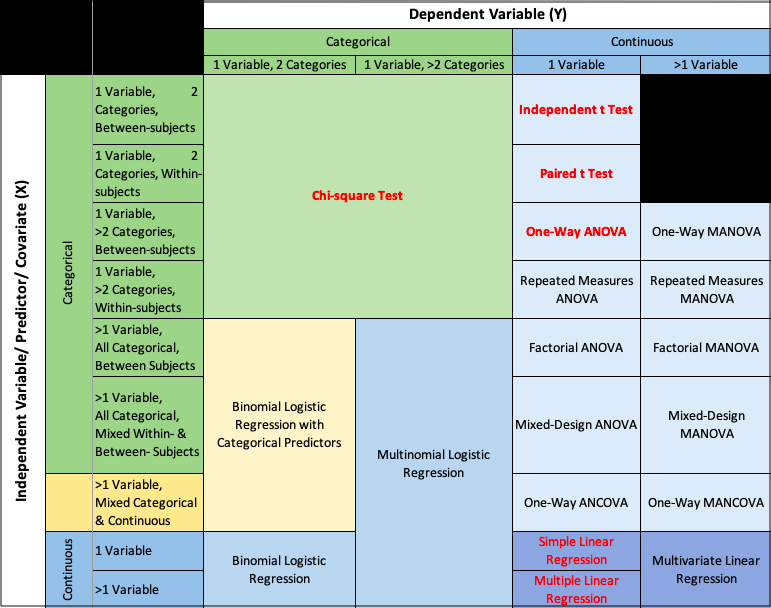

\pagenumbering{arabic}

# Hypothesis Testing

-   Hypothesis testing about population characteristics is another fundamental aspect of statistical inference.

**Definition: Hypothesis**

A *hypothesis* is a statement about a **population parameter**.

-   In testing hypothesis, we start by making *an assumption* with regard to an unknown population characteristic.
-   We then take a random sample from the population, and on the basis of the corresponding sample characteristic, we either accept or reject the hypothesis with a particular degree of confidence.

## Null and alternative hypotheses

```{=html}
<!-- in hypothesis testing we have two contradictory statements about he population characteristics

- we use hypothesis testing to decide which of the these two statements about the parameter is correct-->
```

-   Statistical hypotheses consist of the **null hypothesis** and the **alternative hypothesis,** which together contain all the possible outcomes of the experiment or study.

**null hypothesis**

-   Generally, the *null hypothesis* states that a treatment has *no effect* (and has led to the term "null" hypothesis).

**alternative hypothesis**

-   Usually, alternative hypothesis is the negation, or complement, of the null hypothesis.

-   Usually it is the hypothesis that the researcher is interested in proving.

-   The null hypothesis is denoted $H_0$, and the alternative is denoted $H_1$.

-   Let $\theta$ is a population parameter.

-   the general format of the null hypothesis and alternative hypothesis is $$H_0 : \theta \in \Theta_o \text{ and } H_1 :\theta \in \Theta_o^c$$ where $\Theta_o$ is some subset of the parameter space and $\Theta_o^c$ is its complement.

## Different types of Hypotheses

(1) **simple hypotheses:** both $H_0$ and $H_1$ consist of only one probability distibution

$$H_0: \theta = \theta_0 \text{ vs } H_1: \theta = \theta_1$$ <!--in the null hypothesis just only one point-->

(2) **composite hypothesis:** either $H_0$ or $H_1$ has more than one probability distribution

-   *one sided*: $H_0: \theta \geq \theta_0 \text{ vs } H_1: \theta < \theta_0$
-   *one sided*: $H_0: \theta \leq \theta_0 \text{ vs } H_1: \theta > \theta_0$
-   *two sided*: $H_0: \theta = \theta_0 \text{ vs } H_1: \theta \neq \theta_0$

<!-- alternative hypothesis specify not one value but a range of values.-->

### Writing $H_0$ and $H_1$

1.  The equality sign (eq: $=,\leq, or \geq$)) always goes to $H_0$

2.  $H_0:\text{            }$ $H_1: \text{ which is to be tested (claim to be tested})$

<!--somebody's claim goes to H1-->

3.  $H_0: \text{ initially favoured one before collecting information   }$ $H_1:$

<!--our opinion goes to H0-->

### Two tailed test and one tailed test

**Two tailed test**

-   Two tailed tests always use $=$ and $\neq$ in the statistical hypotheses.
-   Alternative hypothesis allows for either the $>$ or $<$ possibility.
-   Here the research is interested in testing deviations from the null in two directions.

**One tailed test**

-   One tailed tests are always directional, and the alternative hypothesis uses either the $>$ or $<$ sign.

## Rejection region

A critical region, also known as the rejection region, is a set of values for the test statistic for which the null hypothesis is rejected.

<!-- Business statistics(black et all) book page 309 -->

```{r Ch3box4, out.width='100%', fig.asp=.6, fig.align='center', fig.pos='h', fig.cap = "Rejection and nonrejection regions",warning=FALSE, message=FALSE, echo=FALSE}
library(ggplot2)

ggplot()+
  theme_void()+
  theme(panel.border = element_rect(colour = "white", fill=NA, size=1))

```

\newpage

## Errors in testing hypotheses-type I and type II error

-   Samples are used to determine whether to reject $H_0$ or not.

-   Since the decision to reject $H_0$ or not, is based on incomplete (i.e sample information), there is always a possibility of making an incorrect decision.

-   We can make two types errors in testing a hypothesis.

    -   *Type I error:* if $H_0$ is true, but the test incorrectly reject $H_0.$ (reject $H_0$/ $H_0$ true)
    -   *Type II error:* if $H_0$ is false, but the test incorrectly accept $H_0.$ (accept $H_0$/ $H_1$ true)

<!-- in this case null hypothesis is false, but a decision is made to not reject it-->

| $\text{}$ | Decision                    |                             |
|-----------|-----------------------------|-----------------------------|
| Truth     | Accept $H_0$                | Reject $H_0$                |
| ------    | ----------------------      | ------------------          |
| $H_0$     | Correct decision            | **Type I error** ($\alpha$) |
| $H_1$     | **Type II error** ($\beta$) | Correct decision (*power*)  |

-   Typically, a **Type I error is the most serious error** and that is what we try to control.

### Significance level

-   The probability of committing a type I error is called $\alpha$ or *significance level* (level of significance)
-   $\alpha$ equals the area under the curve that is in the rejection region beyond the critical value(s).
-   The value of $\alpha$ is always set before the experiment or study is undertaken.
-   $1-\alpha$ is called the *level of confidence* of the test.
-   Common values of $\alpha$ are 0.05, 0.01, 0.10 and 0.001.

### Power of a test

-   The probability of committing a Type II error is $\beta$.
-   **Power** of a test is equal to $1-\beta.$
-   *i.e.*, the probability of a test rejecting the null hypothesis when the null hypothesis is false.

## Testing hypotheses

-   Typically, the hypothesis testing process is presented in terms of an eight-step approach.

**Task 1: Hypothesise**

Step 1: Establish null and alternative hypotheses.

**Task II: Test**

Step 2: Determine the appropriate statistical test

Step 3: Set the value of $\alpha,$ the Type I error rate.

Step 4: Establish the decision rule

Step 5: Gather sample data

Step 6: Analyse the data

**Task III: Take statistical action**

Step 7: Reach a statistical conclusion.

**Task IV: Determine the business implications**

Step 8: Make a business decision.

-   This process of testing hypothesis is referred as the HTAB system, where HTAB is an abbreviation for Hypothesise, Test, Action, Business.

<!-- Black's book page 314, 315, Manjula madam's note, second year data analysis fir the confidence interval method-->

## Methods of testing hypotheses

### Using the critical value method to test hypotheses

-   A method of testing hypotheses by comparing the sample statistic with the critical value in order to reach a conclusion about rejecting or failing to reject the null hypothesis.

-   Critical region: Set of all values of the test statistic that would cause us to reject null hypothesis.

<!-- get the decision by comparing the test statistics value with the critical value-->

<!-- black's book page 314 p value-->

### Using the p-value to test hypotheses

-   Get the decision by comparing $\alpha$ value with p-value.
-   **p-value:** Probability of observing a *sample statistic* at least as extreme as the observed test statistic computed *under the assumption that* $H_0$ is true.
-   The p-value defines the smallest value of $\alpha$ for which the null hypothesis can be rejected

\newpage

*Example*

-   If the p-value of a test is 0.038, the null hypothesis cannot be rejected at $\alpha =0.01$ because 0.038 is the smallest value of alpha for which the null hypothesis can be rejected. However, the null hypothesis can be rejected for $\alpha = 0.05.$

-   If the p-value of a test is 0.0207, , the researcher would reject the null hypothesis for $\alpha = 0.05$ or $\alpha =0.10$ or any value more than 0.0207.

-   **Virtually every statistical computer program yields this probability (p-value)**

<!-- Majula madam note-->

### Using confidence intervals to test hypotheses

-   Confidence intervals also give some indication about the decision.

\newpage

## Hypothesis Testing for a Single Population

| Scenario | Target Parameter | Conditions | Test Statistic | Test Name |
|--------------|--------------|--------------|-----------------|--------------|
| Test for population mean ($\sigma$ known) | $\mu$ | Population normal (any size) OR unknown with large n ($n \geq 30$) | $z = \frac{\bar{x} - \mu_0}{\sigma/\sqrt{n}}\sim N(0,1)$ | One-sample z-test |
| Test for population mean ($\sigma$ unknown, small n) | $\mu$ | Population normal, small sample ($n < 30$) | $t = \frac{\bar{x} - \mu_0}{S/\sqrt{n}} \sim t_{n-1}$ | One-sample t-test |
| Test for population mean ($\sigma$ unknown, large n) | $\mu$ | Population unknown/normal, large sample ($n \geq 30$) | $t = \frac{\bar{x} - \mu_0}{S/\sqrt{n}}\sim t_{n-1} \text{ or } N(0,1)$ | One-sample t-test (approx. z-test) |
| Test for population proportion | $\theta$ | Binomial population, $n\theta_0 \geq 5$ and $n(1−\theta_0) \geq 5$ | $z = \frac{\hat{p} - \theta_0}{\sqrt{\theta_0(1-\theta_0)/n}} \sim N(0,1)$ | One-sample z-test for proportion |
| Test for population variance | $\sigma^2$ | Population normally distributed | $\chi^2 = \frac{(n-1)S^2}{\sigma^2} \sim \chi^2_{n-1}$ | Chi-square test for variance |

\newpage

## Application of Hypothesis Testing: Choosing the Right Statistical Test

```{r   out.width="100%" , fig.cap="Selection of statistical tests in hypothesis testing based on variable type", echo=FALSE}

```

-   The **dependent variable** (response variable) is the variable that is being measured or tested in an experiment.

-   The **independent variable** (explanatory) is the variable the experimenter manipulates or changes, and is assumed to have a direct effect on the **dependent variable**.

-   **Between-subjects** (or between-groups) study design: different people test each condition, so that each person is only exposed to one condition.

-   **Within-subjects** (or repeated-measures) study design: the same person tests all the conditions.

## References {.unnumbered}

Casella, G., & Berger, R. L. (2002). Statistical inference (Vol. 2, pp. 337-472).Pacific Grove, CA: Duxbury

Mood, A.M., Graybill, F.A. and Boes, D.C. (2007): Introduction to the Theory of Statistics, 3rd Edn. (Reprint). Tata McGraw-Hill Pub. Co. Ltd.

\newpage
\pagenumbering{arabic}

## Chapter 3: Tutorial {.unnumbered}

1.  A recent industry report from over a decade ago found that the average annual income of freelance software developers was \$74,914. An IT economics researcher believes that this figure may have changed over time due to shifts in the tech job market, the rise of remote work, and platform-based freelancing. To investigate this, the researcher collects a random sample of 112 freelance software developers and records their annual incomes. Assume that the population standard deviation of annual income for freelance developers is \$14,530. The sample of 112 developers yields a mean annual income of \$78,695. The researcher wants to check whether the average income of freelance software developers has significantly changed from the previously reported value of \$74,914. Use a significance level of $\alpha = 0.05$ to test the researcher's belief.

<!-- large sample sigma known  z test, two sided-->


2. An IT company manages a server system that is expected to maintain an average response time of 250 milliseconds per request. A system administrator suspects that the server may no longer be maintaining this expected performance. To investigate, a random sample of 20 recorded response times from the previous day was selected. The sample yielded a mean response time of 255.1 milliseconds and a standard deviation of 21.93 milliseconds. Assuming that the response times are normally distributed, test whether the server is operating outside the expected performance level. Use a significance level of $\alpha = 0.05$.


<!-- 
australasian business statistics  page 320. revise the quesiton to IT applciaiton small smaple normal , t etst sigma unknown, two sided-->


3. In professional photography, especially under low-light conditions, image noise is a common challenge. Traditionally, standard noise reduction software resulted in an average image clarity score (on a 0–100 scale) of 471, based on expert assessments after post-processing. Recently, an AI-powered noise reduction tool has been introduced, claiming to improve image clarity beyond the standard level. To evaluate this claim, a photography lab applied the new AI tool to a random sample of 23 photographs taken in challenging lighting conditions. The resulting clarity scores had a sample mean of 498.78 and a sample standard deviation of 46.94. Assuming the clarity scores are normally distributed, test at the 5% level of significance whether the AI tool provides a significant improvement in image clarity over the traditional method

<!-- 
australasian business statistics  page 323. revise the quesiton to IT applciaiton small smaple normal , t etst sigma unknown, one sided-->


4. An AI company claims that only 8% of images processed through their noise reduction algorithm still show visible noise artifacts. A quality assurance researcher wants to test this claim. To evaluate the system, the researcher randomly selects a sample of 200 processed images and inspects them for noticeable noise. It is found that 33 images still contain visible noise artifacts. Using a significance level of 0.10, test whether the proportion of flawed images is significantly different from the claimed 8%.

<!-- 
australasian business statistics  page 325. revise the quesiton to IT applciaiton propotion, two taled test-->

5. A university  survey reveals that 17% of undergraduates use generative AI tools (such as ChatGPT) during online exams, often doing so without a proper understanding of the course material or taking the time to critically assess the responses provided. This **overreliance** not only undermines genuine learning but also reflects a lack of academic discipline — a habit that can severely affect one’s long-term development and ability to compete in the professional world. A researcher believes this issue is more prevalent among undergraduates in a particular degree programme at a university. To test this, a random sample of 550 students from that programme was surveyed, with 115 reporting over-reliance on AI during their most recent online exam. Using a significance level of 0.05, test if the proportion of students in this programme is higher than the university average of 17%.

<!-- 
australasian business statistics  page 329. revise the quesiton to IT applciaiton propotion, one  taled test-->


6. An aviation maintenance company has been working diligently to implement a just-in-time (JIT) inventory system for its aircraft component repair line. The final product requires the installation of specific engine components at a particular workstation during the repair process. With the JIT system, the company aims to minimize the number of components waiting at the station to be installed, as storage costs for excess inventory are very high. Ideally, the components would arrive just as the technician needs them. However, due to supplier and transportation variables, there is often some buildup of component inventory. The company expects that, on average, about 20 engine components will be at the station. However, the maintenance manager does not want the variance of this inventory to exceed 4. On a given day, the number of components at the workstation is recorded at eight different times, and the sample variance is calculated as 20.9821. Assume the number of components is normally distributed. Use a significance level of 0.05 to test whether the variance exceeds the acceptable limit.


<!--australasian business statistics  page 332. revise the quesiton to IT applciaiton variance, one  taled test-->

7. A tech company specializing in AI solutions uses automated project management tools to assign tasks and track project timelines for its 37 employees. Despite these tools, unexpected client requests and urgent model updates often result in overtime work. Historically, the company estimates around 50 total overtime hours per week, with a variance of 25 $hours$. To assess whether the variability in weekly overtime has shifted from this historical estimate, management analyzes system-logged overtime data over 16 randomly selected weeks. The sample variance is 28.1. Assuming weekly overtime hours are normally distributed, use a significance level of 0.10 to test whether there is evidence that the variance is no longer 25.


<!--australasian business statistics  page 333. revise the quesiton to IT applciaiton variance, two  taled test-->